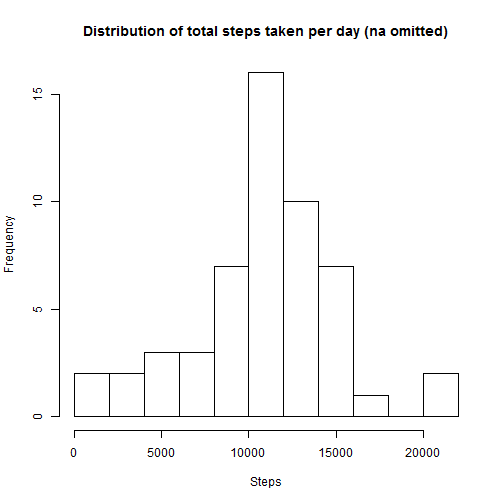

### Introduction

This document is the first peer assessment for the 'Reproducible Research' course which is part of the [Data Science Specialisation][dss] provided by [Johns Hopkins Bloomberg School of Public Health][jhsph] via [Coursera][co].

The aim of this assessment is to prove the ability to use literate programming, in particular *R Mark Down*.

This assignment makes use of data from a personal activity monitoring device. This device collects data at 5 minute intervals through out the day. The data consists of two months of data from an anonymous individual collected during the months of October and November, 2012 and include the number of steps taken in 5 minute intervals each day.

[dss]: https://www.coursera.org/specialization/jhudatascience/1
[jhsph]: http://www.jhsph.edu/
[co]: https://www.coursera.org/

## Loading and preprocessing the data


```r
unzip("activity.zip", exdir = ".", unzip = "internal", setTimes = FALSE) #unzips the file
activityData  <- read.csv("activity.csv", header = TRUE)
unlink("activity.csv")
```

First and foremost let's explore the raw data to get a sense of how its format.


```r
str(activityData)
```

```
## 'data.frame':	17568 obs. of  3 variables:
##  $ steps   : int  NA NA NA NA NA NA NA NA NA NA ...
##  $ date    : Factor w/ 61 levels "2012-10-01","2012-10-02",..: 1 1 1 1 1 1 1 1 1 1 ...
##  $ interval: int  0 5 10 15 20 25 30 35 40 45 ...
```

From the output above we see that the date is coming as a *Factor*, converting it to a *Date* is more suitable for 
our analysis and let's output a summary.


```r
activityData$date  <- as.Date(activityData$date, "%Y-%m-%d")

summary(activityData) 
```

```
##      steps             date               interval     
##  Min.   :  0.00   Min.   :2012-10-01   Min.   :   0.0  
##  1st Qu.:  0.00   1st Qu.:2012-10-16   1st Qu.: 588.8  
##  Median :  0.00   Median :2012-10-31   Median :1177.5  
##  Mean   : 37.38   Mean   :2012-10-31   Mean   :1177.5  
##  3rd Qu.: 12.00   3rd Qu.:2012-11-15   3rd Qu.:1766.2  
##  Max.   :806.00   Max.   :2012-11-30   Max.   :2355.0  
##  NA's   :2304
```


## What is mean total number of steps taken per day?

Let's plot the distribuition of the total number of steps taken per day.


```r
totalPerDay  <- aggregate(steps ~ date, activityData, FUN=sum, na.action = na.omit)

hist(totalPerDay$steps, freq = TRUE, breaks = 12, xlab="Steps", main="Distribution of total steps taken per day (na omitted)")
```

 

```r
meanTotal  <- mean(totalPerDay$steps)

meanTotal
```

```
## [1] 10766.19
```

```r
median(totalPerDay$steps)
```

```
## [1] 10765
```

From the plot we can see that the distribuition of the total number of steps taken per day is normal and has a mean of ``10766.2``.


## What is the average daily activity pattern?

Let's first calculate the average number of steps grouped by intervals, we are going to ignore (omit) any missed readings.


```r
averagePerTimeInterval  <- aggregate(steps ~ interval, activityData, FUN=mean, na.action = na.omit)

# Converting the time slot in a more familiar format to read (e.g. 14:45 as opposed to 1445)
averagePerTimeInterval$intervalInHoursAndMinutes <-  sprintf("%02d:%02d", 
                                            averagePerTimeInterval$interval%/%100, 
                                            averagePerTimeInterval$interval%%100) 

maxStepsInterval  <- averagePerTimeInterval$intervalInHoursAndMinutes[which(averagePerTimeInterval$steps == max(averagePerTimeInterval$steps))]
```


In the following plot we can see the average daily activity across all days, we can see a spike in activity between 07:30 and 10:00 with its peak number of steps in the 5 minutes slot commencing at ``08:35``, reaching an average of ``206.17`` in only 5 minutes.


```r
plot(averagePerTimeInterval$steps, type="l", xaxt = "n", ylab="Average Steps", xlab="Time of day", main = "Average daily activity pattern")

axis(1, at=1:288, labels = averagePerTimeInterval$intervalInHoursAndMinutes)
```

 


## Imputing missing values

As we have noticed in our initial exploratory analysis there are a number of days/intervals where there are missing values (coded as NA). The presence of missing days may introduce bias into some calculations or summaries of the data.


```r
missingValuesCount  <- sum((is.na(activityData$steps)))
```

There are ``2304`` missing values in the dataset.

We want to devise a strategy for filling in all of the missing values in the dataset. We are going to use the mean across all days of the same 5-minute interval to fill in the missing readings.

Let's create a new dataset where we are going to replace all the missing values.


```r
#Replace the missing steps with the average for that same interval across all days
missingSteps  <- apply(activityData[is.na(activityData$steps), c("steps", "interval")],1, function(x){averagePerTimeInterval$steps[averagePerTimeInterval$interval ==x[2]]})

activityDataPolyfill  <- activityData

activityDataPolyfill$steps[is.na(activityDataPolyfill$steps)]  <- missingSteps
```

Similarly to what we have done before with the initial dataset, we are going to make a histogram plot of the total number of steps taken each day using the newly generated dataset which has had all its missing values replaced, we are going to calculate and report the mean and median total number of steps taken per day. 


```r
totalPerDayPolyfill  <- aggregate(steps ~ date, activityDataPolyfill, FUN=sum)

hist(totalPerDayPolyfill$steps, freq = TRUE, breaks = 12, xlab="Steps", main="Distribution of total steps taken per day (na replaced)")
```

 

```r
mean(totalPerDayPolyfill$steps)
```

```
## [1] 10766.19
```

```r
median(totalPerDayPolyfill$steps)
```

```
## [1] 10766.19
```


```r
percentMissingValues  <- sprintf('%.2g%%',length(activityData$steps[is.na(activityData$steps)]) / length(activityData$steps) * 100)
```

Missing values are roughly 13% of the overall data. After replacing all missing values with the average number of steps for that same time interval, the data has maintained its normal distribution but the frequency of days where the number of steps are above 10000 has increased as well as the frequency throughout the distribution.

Having introduced average values to fill in the NA's has led to the *Median* and *Mean* to match.

## Are there differences in activity patterns between weekdays and weekends?

Let's create a new factor variable in the dataset with two levels - "weekday" and "weekend" indicating whether a given date is a weekday or weekend day.


```r
isWeekend  <- weekdays(activityDataPolyfill$date, TRUE) %in% c("Sun", "Sat")

activityDataPolyfill$dayOfWeek  <- factor(isWeekend, levels = c(TRUE, FALSE), labels = c("weekend", "weekday"))
```

Let's create a time series plot of the average number of steps taken, averaged across all weekday days or weekend days. 


```r
library(lattice)

averagePerTimeIntervalPolyfill  <- aggregate(steps ~ interval+dayOfWeek, activityDataPolyfill, FUN=mean)

xyplot(averagePerTimeIntervalPolyfill$steps~averagePerTimeIntervalPolyfill$interval|averagePerTimeIntervalPolyfill$dayOfWeek, 
       layout = c(1,2), type="l", ylab="Steps", xlab="Interval")
```

 

From the plot of the two sets of activities we can see that during weekends there is no single great spike of activity around 08:35 which instead is showin during weekdays, also during weekends activity remains higher during the course of day and does not see a sharp decrease after the morning spike.

From this last plot it seems that during weekdays the individual did  most of his/her steps during what might have been commuting to work but his/her activity level decreased soon after and remained pretty low throughout the day with a slight increase in the late evening. During weekends the level of activity instead remained higher throughout the day.

