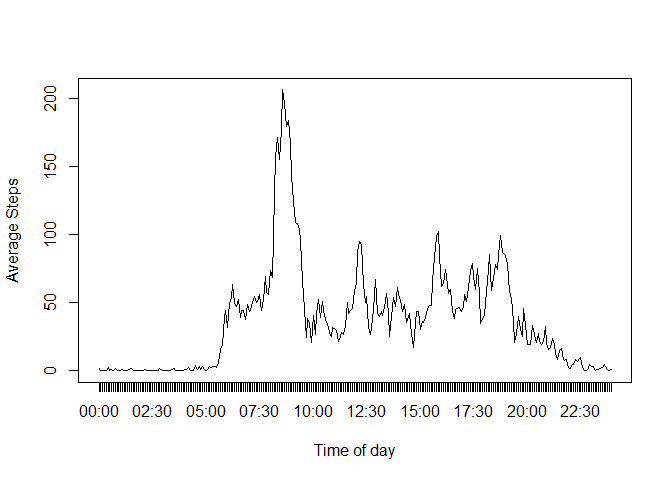

# Reproducible Research: Peer Assessment 1
Giuseppe Romagnuolo  
Wednesday, April 15, 2015  

### Introduction

This document is the first peer assessment for the 'Reproducible Research' course which is part of the [Data Science Specialisation][dss] provided by [Johns Hopkins Bloomberg School of Public Health][jhsph] via [Coursera][co].

The aim of this assessment is to prove the ability to use literate programming, in particular *R Mark Down*.

This assignment makes use of data from a personal activity monitoring device. This device collects data at 5 minute intervals through out the day. The data consists of two months of data from an anonymous individual collected during the months of October and November, 2012 and include the number of steps taken in 5 minute intervals each day.

[dss]: https://www.coursera.org/specialization/jhudatascience/1
[jhsph]: http://www.jhsph.edu/
[co]: https://www.coursera.org/

## Loading and preprocessing the data


```r
unzip("activity.zip", exdir = ".", unzip = "internal", setTimes = FALSE) #unzips the file
activityData  <- read.csv("activity.csv", header = TRUE)
unlink("activity.csv")
```

Exploring the raw data:


```r
str(activityData)
```

```
## 'data.frame':	17568 obs. of  3 variables:
##  $ steps   : int  NA NA NA NA NA NA NA NA NA NA ...
##  $ date    : Factor w/ 61 levels "2012-10-01","2012-10-02",..: 1 1 1 1 1 1 1 1 1 1 ...
##  $ interval: int  0 5 10 15 20 25 30 35 40 45 ...
```

Transforming the ```activityData$date``` field from *Factor* to *Date*


```r
activityData$date  <- as.Date(activityData$date, "%Y-%m-%d")

str(activityData)
```

```
## 'data.frame':	17568 obs. of  3 variables:
##  $ steps   : int  NA NA NA NA NA NA NA NA NA NA ...
##  $ date    : Date, format: "2012-10-01" "2012-10-01" ...
##  $ interval: int  0 5 10 15 20 25 30 35 40 45 ...
```

```r
summary(activityData)
```

```
##      steps             date               interval     
##  Min.   :  0.00   Min.   :2012-10-01   Min.   :   0.0  
##  1st Qu.:  0.00   1st Qu.:2012-10-16   1st Qu.: 588.8  
##  Median :  0.00   Median :2012-10-31   Median :1177.5  
##  Mean   : 37.38   Mean   :2012-10-31   Mean   :1177.5  
##  3rd Qu.: 12.00   3rd Qu.:2012-11-15   3rd Qu.:1766.2  
##  Max.   :806.00   Max.   :2012-11-30   Max.   :2355.0  
##  NA's   :2304
```


## What is mean total number of steps taken per day?

Calculate the total number of steps taken per day.
Make a histogram of the total number of steps taken each day.
Calculate and report the mean and median of the total number of steps taken per day


```r
totalPerDay  <- aggregate(steps ~ date, activityData, FUN=sum, na.action = na.omit)

hist(totalPerDay$steps, freq = TRUE, breaks = 12, xlab="Number of steps", main="Histogram of total number of steps taken each day")
```

 

```r
mean(totalPerDay$steps)
```

```
## [1] 10766.19
```

```r
median(totalPerDay$steps)
```

```
## [1] 10765
```


## What is the average daily activity pattern?

1. Make a time series plot (i.e. type = "l") of the 5-minute interval (x-axis) and the average number of steps taken, averaged across all days (y-axis)


```r
averagePerTimeInterval  <- aggregate(steps ~ interval, activityData, FUN=mean, na.action = na.omit)

# Converting the time slot in a more familiar format to read (e.g. 14:45 as opposed to 1445)
averagePerTimeInterval$intervalInHoursAndMinutes <-  sprintf("%02d:%02d", 
                                            averagePerTimeInterval$interval%/%100, 
                                            averagePerTimeInterval$interval%%100) 


plot(averagePerTimeInterval$steps, type="l", xaxt = "n", ylab="Average Steps", xlab="Time of day")

axis(1, at=1:288, labels = averagePerTimeInterval$intervalInHoursAndMinutes)
```

 

2. Which 5-minute interval, on average across all the days in the dataset, contains the maximum number of steps?


```r
averagePerTimeInterval[which(averagePerTimeInterval$steps == max(averagePerTimeInterval$steps)), c(3, 2)]
```

```
##     intervalInHoursAndMinutes    steps
## 104                     08:35 206.1698
```

## Imputing missing values

Note that there are a number of days/intervals where there are missing values (coded as NA). The presence of missing days may introduce bias into some calculations or summaries of the data.

1. Calculate and report the total number of missing values in the dataset (i.e. the total number of rows with NAs)


```r
sum((is.na(activityData$steps)))
```

```
## [1] 2304
```


2. Devise a strategy for filling in all of the missing values in the dataset. The strategy does not need to be sophisticated. For example, you could use the mean/median for that day, or the mean for that 5-minute interval, etc.

3. Create a new dataset that is equal to the original dataset but with the missing data filled in.


```r
#Replace the missing steps with the average for that same interval across all days
missingSteps  <- apply(activityData[is.na(activityData$steps), c("steps", "interval")],1, function(x){averagePerTimeInterval$steps[averagePerTimeInterval$interval ==x[2]]})

activityDataPolyfill  <- activityData

activityDataPolyfill$steps[is.na(activityDataPolyfill$steps)]  <- missingSteps
```

4. Make a histogram of the total number of steps taken each day and Calculate and report the mean and median total number of steps taken per day. Do these values differ from the estimates from the first part of the assignment? What is the impact of imputing missing data on the estimates of the total daily number of steps?

```r
totalPerDayPolyfill  <- aggregate(steps ~ date, activityDataPolyfill, FUN=sum)

hist(totalPerDayPolyfill$steps, freq = TRUE, breaks = 12, xlab="Number of steps", main="Histogram of total number of steps taken each day")
```

 

```r
mean(totalPerDayPolyfill$steps)
```

```
## [1] 10766.19
```

```r
median(totalPerDayPolyfill$steps)
```

```
## [1] 10766.19
```


```r
percentMissingValues  <- sprintf('%.2g%%',length(activityData$steps[is.na(activityData$steps)]) / length(activityData$steps) * 100)
```

Missing values are roughly 13% of the overall data. After replacing all missing values with the average number of steps for that same time interval across all days, the data has maintained the same distribution but the number of days where the number of steps are above 10000 has increased.

Also the *Median* now matches the *Mean*.


## Are there differences in activity patterns between weekdays and weekends?

For this part the weekdays() function may be of some help here. Use the dataset with the filled-in missing values for this part.

1. Create a new factor variable in the dataset with two levels - "weekday" and "weekend" indicating whether a given date is a weekday or weekend day.


```r
isWeekend  <- weekdays(activityDataPolyfill$date, TRUE) %in% c("Sun", "Sat")

activityDataPolyfill$dayOfWeek  <- factor(isWeekend, levels = c(TRUE, FALSE), labels = c("weekend", "weekday"))

head(activityDataPolyfill)
```

```
##       steps       date interval dayOfWeek
## 1 1.7169811 2012-10-01        0   weekday
## 2 0.3396226 2012-10-01        5   weekday
## 3 0.1320755 2012-10-01       10   weekday
## 4 0.1509434 2012-10-01       15   weekday
## 5 0.0754717 2012-10-01       20   weekday
## 6 2.0943396 2012-10-01       25   weekday
```

2. Make a panel plot containing a time series plot (i.e. type = "l") of the 5-minute interval (x-axis) and the average number of steps taken, averaged across all weekday days or weekend days (y-axis). See the README file in the GitHub repository to see an example of what this plot should look like using simulated data.


```r
library(lattice)

averagePerTimeIntervalPolyfill  <- aggregate(steps ~ interval+dayOfWeek, activityDataPolyfill, FUN=mean)

xyplot(averagePerTimeIntervalPolyfill$steps~averagePerTimeIntervalPolyfill$interval|averagePerTimeIntervalPolyfill$dayOfWeek, 
       layout = c(1,2), type="l", ylab="Steps", xlab="Interval")
```

 

